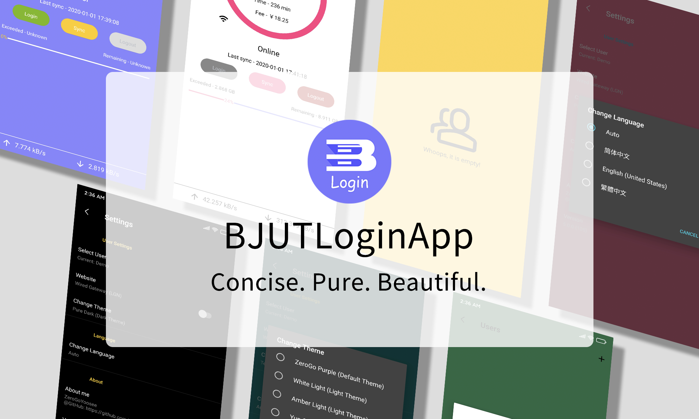
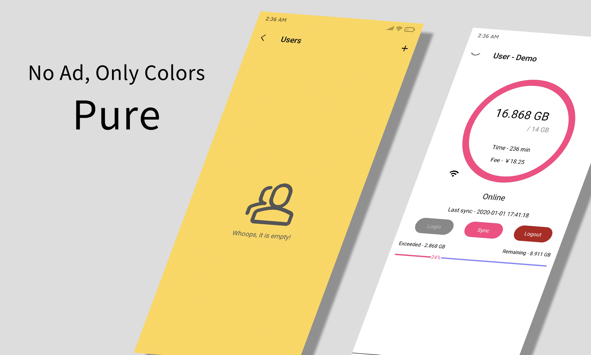
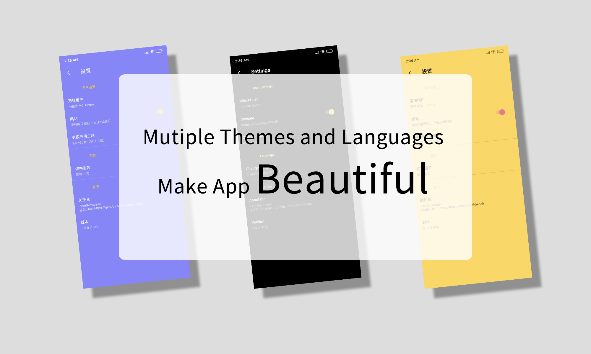

    
    
    
    
    

# Downloads & Requirement
You can download this app by accessing [GitHub Releases](https://github.com/ZeroGoYoosee/BJUTLoginApp/releases) or [fir.im(latest release)](https://fir.im/BJUTLoginApp). Builds in **version 5** are availble for **Android Oreo and above**. 

For devices between Android Marshmallow(6.0) and Android Nougat(7.1), You can download this app [GitHub 4.1.0 Releases](https://github.com/z7workbench/BJUTLoginApp/releases/tag/v4.1.0) or [fir.im(build 4)](https://fir.im/BJUTLoginAppOld). 

You can always get the latest updates on branch ``dev``.

# Overview
BJUT Login App is a simple Android App for students from Beijing University of Technology. It helps log in BJUT gateway. **This app is not a VPN.**

It is written in Kotlin. If you want Java version, you would check out ``version-3`` branch. However, the Java version is **deprecated**. 

The release of Version 5 is out! Please check out the [GitHub Releases](https://github.com/ZeroGoYoosee/BJUTLoginApp/releases) or [fir.im(latest release)](https://fir.im/BJUTLoginApp).

For more details of the developing edition, please watch the ``dev`` branch. 

# How to use
Give your student ID and password in [Settings], then press [Login] button. 

Make sure your phone can access ``bjut_wifi`` network.

# Features

    
    
    

# Materials that I used
- [Kotlin](https://github.com/JetBrains/kotlin)
- [Android Jetpack](https://developer.android.com/jetpack)
- [Okhttp 4](https://github.com/square/okhttp)
- [View Binding](https://developer.android.com/topic/libraries/view-binding)
- [Fancybutton](https://github.com/medyo/Fancybuttons)
- [NumberProgressBar](https://github.com/daimajia/NumberProgressBar)
- [ColorfulRingProgressView](https://github.com/timqi/SectorProgressView)
- [Travis CI](https://travis-ci.org/)
- [Android KTX](https://developer.android.com/kotlin/ktx)
- [Butterknife](https://github.com/JakeWharton/butterknife) (not use after the first development version of ``4.0.0``)
- [Kotlin Android Extensions](https://kotlinlang.org/docs/tutorials/android-plugin.html) (not use after ``5.0.0-beta6``)
- [JetBrains anko](https://github.com/Kotlin/anko) (not use after ``5.0.2``)
