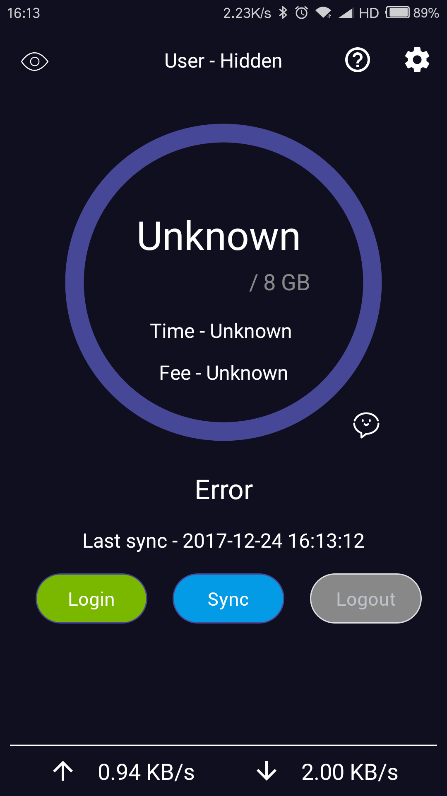

# BJUT Login App
[](https://travis-ci.org/ZeroGoYoosee/BJUTLoginApp) [](https://developer.android.com/reference/android/os/Build.VERSION_CODES.html#M) [](https://github.com/ZeroGoYoosee/BJUTLoginApp/releases) [](https://github.com/ZeroGoYoosee/BJUTLoginApp/releases)

---
## Overview & Screenshot
BJUT Login App is an Android App for students from Beijing University of Technology. It helps log in BJUT gateway. 
It is written in Kotlin. If you want Java version, you would check out '3.0.0' branch. 

```
git clone https://github.com/ZeroGoYoosee/BJUTLoginApp.git
git checkout 3.0.0
```

However, it is deprecated. 

### Main View


## How to use
Give your student ID and password in [Settings], then press [Login] button. 
Make sure your phone is in 'bjut_wifi'.

## Downloads
[GitHub Releases](https://github.com/ZeroGoYoosee/BJUTLoginApp/releases) or [fir.im](https://fir.im/BJUTLoginApp)
